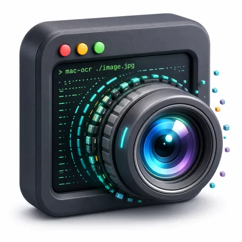
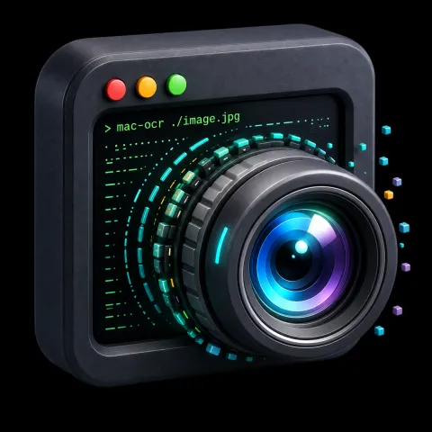
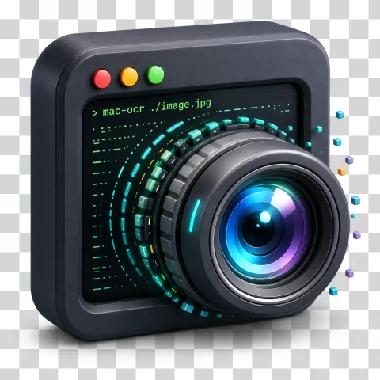

<h1 align="center">
	
	<br>
	unbg
</h1>

Create a transparent PNG from an AI-generated or existing image. Give unbg **two matching versions of the image on different solid background colors**, and it diffs the background out.

Unlike cutout tools that guess at a mask, unbg solves the compositing equation directly (_difference matting_). Because it has two observations of every pixel, it can recover soft edges, anti-aliasing, glows, and partial transparency instead of producing only a hard outline.

## Quick start

1. **Start with one solid-background image.** Keep an AI-generated or existing image if its background is already flat and solid. Otherwise, use an AI image editor such as Gemini Nano Banana to put it on a solid color.
2. **Edit only the background.** Ask the AI for a matching version on a distinctly different solid color. Black and white are the simplest pair: if the original is black, make the second one white.
3. **Give both versions to unbg.** Download the transparent PNG.

Prompt for the second image:

> Keep the subject, composition, dimensions, lighting, colors, and every visible detail unchanged. Change only the background to a flat solid [TARGET COLOR, e.g. pure white (#ffffff)]. Do not move, redraw, resize, or restyle the subject.

Always edit the first solid-background image to make the second one. Do not generate both images separately: even a small change in the subject's position or details will appear in the result.

For example, a logo generated with Gemini on white and then edited onto black gives unbg the pair it needs:

| On white | On black | Output |
| :---: | :---: | :---: |
|  |  |  |
| Generate or edit onto white | Edit only the background to black | Diff the background out |

### Try it online ⚡️

No install required: **[unbg runs entirely in your browser](https://unbg.hirok.io/)**. Drop in the two images and download the transparent PNG. Nothing is uploaded; the matting runs locally on your device.

### Requirements

- **Same dimensions and pixel-aligned:** the subject must not move or change between the two images.
- **Uniform solid backgrounds:** one color each, as flat as possible.
- **Distinct background colors:** any well-separated colors work, but greater separation produces a cleaner result. **Pure black and white are ideal, not required.**
- **PNG, JPEG, or WebP input; PNG output:** PNG is the safest input because it is lossless. JPEG and lossy WebP can desync the pair and corrupt the matte.

Generative edits can still introduce small differences. The more faithfully the model preserves the subject, the cleaner the transparent result will be.

## Install

Run the CLI on demand with no install:

```sh
npx unbg <image1> <image2>
```

Or install the CLI globally for repeated use:

```sh
npm install --global unbg
```

For programmatic use with the [Node.js API](#nodejs-api), install it locally in your project instead:

```sh
npm install unbg
```

## CLI

```sh
unbg <image1> <image2> [flags]
```

```sh
unbg bg-white.png bg-black.png --output logo.png
```

| Argument or flag | Description |
| --- | --- |
| `<image1> <image2>` | Pixel-aligned input images. Supports PNG (`.png`), JPEG (`.jpg`, `.jpeg`), and static WebP (`.webp`). |
| `-o, --output <path>` | Output PNG path (default: derived from the input names, beside the first image) |
| `--background1 <color>` | Background color of `image1` as hex (`#rrggbb`) or `r,g,b` (default: auto-detect from corners) |
| `--background2 <color>` | Background color of `image2` (default: auto-detect from corners) |
| `--threshold <0-255>` | Minimum per-channel background difference for a channel to inform the alpha estimate (default: `10`) |
| `--floor <0-1>` | Snap alpha at or below this to fully transparent to suppress background noise (default: `0`, off) |
| `--ceiling <0-1>` | Snap alpha at or above this to fully opaque to suppress haze (default: `1`, off) |
| `--crop [0-1]` | Trim transparent edges. With no value, sparse edge rows and columns are trimmed automatically. A value ignores pixels at or below that opacity when finding the bounds; it does not alter retained pixels. |

unbg does not remove a background from only one input. It compares both aligned images to recover alpha, then recovers foreground color from both images equally. Alpha always comes from comparing both images.

The CLI reports `Background distance`, which measures the separation between the two detected background colors. Below `50`, use more distinct colors.

With bare `--crop`, the CLI uses automatic edge-density trimming. With a numeric value, it also reports the first threshold that removes a non-transparent edge pixel.

Use `--crop` to trim fully transparent edges and sparse edge rows or columns while preserving the subject's natural aspect ratio. Automatic cropping treats fewer than 1% visible pixels on an edge as sparse. Use `--crop 0.02` for exact threshold-based trimming that ignores pixels with alpha at or below `0.02` only when finding the bounds. The crop threshold does not change pixels inside the resulting rectangle.

When `--output` is omitted, the name is derived from the inputs' shared prefix (`logo-white.png` + `logo-black.png` → `logo.png`) and written beside the first image; if that file already exists, a counter is appended (`logo-1.png`). The resolved path and file size are printed when done.

Background colors are auto-detected by averaging the four corner pixels. Override them when the subject reaches into the corners, or when you already know the exact colors:

```sh
unbg a.png b.png --background1 "#ffffff" --background2 0,0,0
```

## Node.js API

```ts
import { readFile, writeFile } from 'node:fs/promises'
import { unbg } from 'unbg'

const [onWhite, onBlack] = await Promise.all([
    readFile('on-white.png'),
    readFile('on-black.png')
])
const { image } = await unbg(onWhite, onBlack)

await writeFile('transparent.png', image)
```

#### `unbg(image1, image2, options?)`

Decodes PNG, JPEG, and WebP inputs with [jSquash](https://github.com/jamsinclair/jSquash) WebAssembly codecs and runs difference matting.

- `image1`, `image2`: opaque PNG, JPEG, or static WebP bytes as a `Buffer` or `Uint8Array`. Read files before calling `unbg()`. Animated WebP and source transparency are not supported.
- `options`
  - `background1?`, `background2?`: `{ r, g, b }` overrides with finite components from `0` to `255`; auto-detected from corners when omitted.
  - `channelThreshold?`: minimum per-channel background difference from `0` to `255` (default `10`). Matting throws when no channel meets it.
  - `floor?` / `ceiling?`: snap alpha to fully transparent / opaque at or below / above these thresholds (0-1), suppressing matte artifacts. `floor` must not exceed `ceiling`. Defaults `0` / `1` (off).
  - `crop?`: `true` uses automatic edge-density trimming. A number from `0` to `1` sets the alpha threshold used only to calculate the crop bounds.

- **Returns** `{ image, width, height, background1, background2, backgroundDistance, cropClippingThreshold }`, where `image` is the **PNG-encoded bytes** (`Uint8Array`) of the result. `cropClippingThreshold` is the first numeric threshold that removes a non-transparent edge pixel, or `null` when the matte has no non-transparent pixels. unbg never writes files. Persist it with `fs.writeFile`, return it from a server, or upload it. For raw pixels or a different encoding, import `differenceMatting` from `unbg/core`.

`backgroundDistance` is the Euclidean distance between the two background colors (0-441.7). Below ~50 the extraction is noisy; use more distinct backgrounds.

### Core API

Import raw-pixel operations from `unbg/core`. This dependency-free entry runs in browsers, Web Workers, and edge runtimes. It operates on decoded RGBA data, so the host owns decoding, encoding, and file I/O.

```ts
import {
    cropContent,
    cropTransparent,
    detectBackground,
    differenceMatting
} from 'unbg/core'
```

#### `differenceMatting(image1, image2, options?)`

Lower-level core that operates on opaque `RgbaImage` objects: `{ data, width, height }`, where `data` is a raw RGBA `Uint8Array` of `width * height * 4` bytes. It has no codec or I/O. Returns the matte as an `RgbaImage` plus `{ background1, background2, backgroundDistance, cropClippingThreshold }`. Use it when you already have decoded pixel data. `cropContent(image)` accepts a transparent RGBA matte and trims edge rows and columns with fewer than 1% visible pixels. `cropTransparent(image, threshold?)` accepts a transparent RGBA matte and uses a normalized alpha value only for the crop bounds.

#### `detectBackground(image)`

Estimates a background `{ r, g, b }` by averaging the four corner pixels of an `RgbaImage`.

Only `unbg()` and the CLI are Node-only: `unbg()` loads image codecs and the CLI handles file I/O. The [web demo](https://unbg.hirok.io/) runs entirely on `unbg/core`.

## Agent skills

unbg ships an [agent skill](https://agentskills.io) that [`skills-npm`](https://github.com/antfu/skills-npm) discovers automatically, so coding agents like **Claude Code** and **Codex** know when and how to reach for it.

## How it works

The technique of generating on white, editing to black, then diffing to recover alpha comes from Julien De Luca's [_Generating transparent background images with Nano Banana Pro 2_](https://medium.com/@jidefr/generating-transparent-background-images-with-nano-banana-pro-2-1866c88a33c5).

A photo over a solid background is a blend of the foreground and the background, weighted by the pixel's opacity:

```
observed = α·foreground + (1 - α)·background
```

Shoot the same subject over two known backgrounds and you get two equations per pixel. This is enough to solve for both the opacity (`α`) and the original foreground color:

```
α = 1 - (observed₁ - observed₂) / (background₁ - background₂)
```
